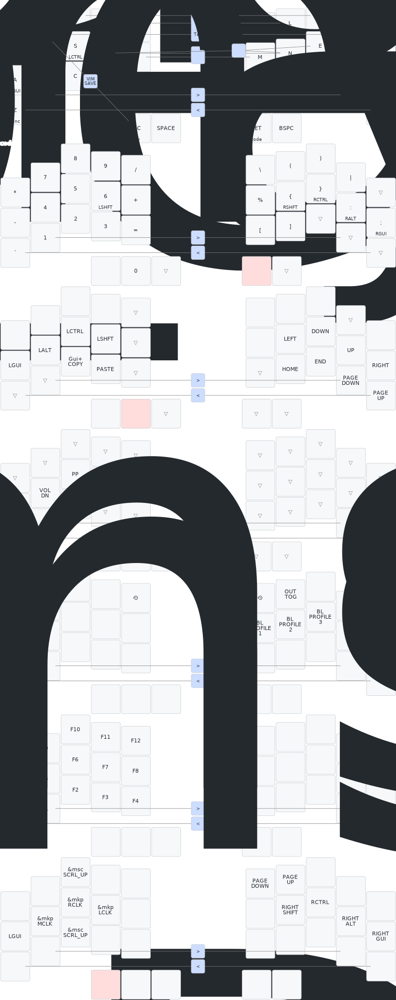

# Anglerfish Keyboard

Anglerfish, is a split keyboard with 3x5 column staggered keys, two thumb keys, and a trackpoint.

The Trackpoint can be placed on either side, and the PCB is a reversible design.

---

---

### Models
You can find all the step files for the case [here](assets/models)

### Electronic Components 
[Build of materials](assets/bom.md)

### Default Firmware Keymap

---

### Build Guide
Soon...

> [!NOTE]\
> IMPORTANT: When submitting the gerber for manufacturing, set the PCB thickness to 0.8mm.

> [!WARNING]\
>  Gotchas
> Trackpoint ZMK support is bleeding edge. Thar be dragons.
